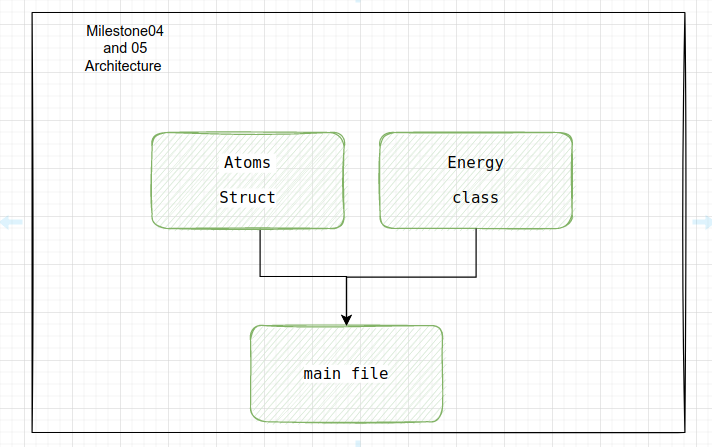
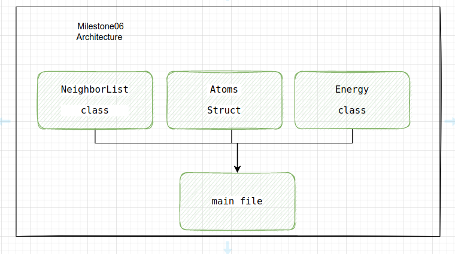
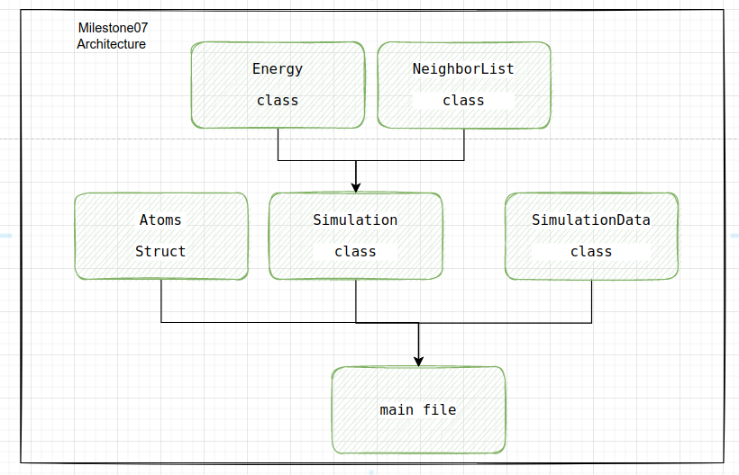
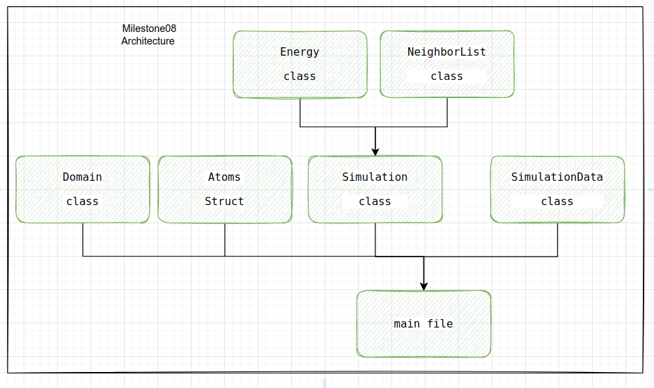

# Molecular Dynamics Simulation with C++

## Report
the report can be found in the `Report` folder here: [report](Report/latex/report_main.pdf)

## Structure of the project

The main branch is the `main` branch, it has the most updated codes
and the most updated report. And you can run all milestones from this branch. But just in case if some milestone doesn't work, you can switch to the corresponding branch (it starts with `ready-milestone*`) to run the milestone.  
Also there exist two branches to run milestones 7 and 8 on the cluster (it starts with `rmilestone*-on-cluster`), it's basically the same codes as the `ready-milestone*` branchs, but different directory structure.

Milestone 08 (main branch) in here: [milestone 08](https://github.com/eslamsalahelsheikh/Molecular-Dynamics/blob/main/milestones/08/main.cpp) has the parallel version of the code, so you need to compile it with `mpic++` compiler. and to use the parallel version you need to run the code with `mpirun` command. While all other milestones can be compiled and run with `g++` compiler.

## How to change the parameters of the simulation according the report:

### Milestones 4, 5, and 6:
  - The parameters exist in the corresponding `main.cpp` file, you can change the parameters there, and make sure to change the directories as well.
### Milestone 7,8:
  - The parameters are in a new class called the `SimulationData` and can be found in the `simulation_data.cpp` [file](https://github.com/eslamsalahelsheikh/Molecular-Dynamics/blob/ee1ff39e193bd1738b058f900f170b60eb6c6170/src/simulation_data.cpp).
  - In the same file,you will need to change the directories for outputs in [here](https://github.com/eslamsalahelsheikh/Molecular-Dynamics/blob/ee1ff39e193bd1738b058f900f170b60eb6c6170/src/simulation_data.cpp#L41) and [here](https://github.com/eslamsalahelsheikh/Molecular-Dynamics/blob/ee1ff39e193bd1738b058f900f170b60eb6c6170/src/simulation_data.cpp#L43).
  - Note: milestone8 uses the `cluster_file` as input while milestone7 uses the `layer_numbers` and `atomic_distance` to automatically create cluster and use it as input.

## How to generate the same graphs as the report:
The output files from each milestone are stored in the `output` folder, and in each milestone folder inside this `output` folder there is a python file that can be used to generate the same graphs as the report.

## Codes architectures:

### Milestone 4-5:

### Milestone 6:

### Milestone 7:

### Milestone 8:

